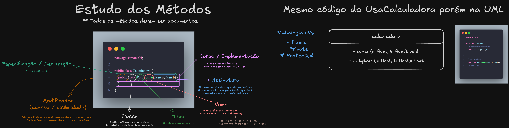

# Diferença entre classe e aplicação

Uma aplicação é algo executável, ela consome classes. Se tem main é aplicação.
ex: public static void main (String args[])

Uma classe serve como um modelo para ser consumida. Se não tem main é uma classe.
ex:public static void maim (String args[])

# JDK vs JVM

JDK é o kit para rodar o java.
JMV é a máquina virtual do java que o interpreta.

# Comandos para compilar e executar um arquivo .java

compila: javac c:/temp/BoaNoite.java
executa: java -cp c:/temp BoaNoite

# Duas formas de criar um array no Java

## 1º forma

String[] vetor = {"10","20"};

## 2º forma

String[] v = new String[2];
v[0] = "30";
v[1] = "40";

# Função vs Método

Função é algo genérico, já o método é um trecho que manipula o conteúdo de um objeto.

Veja o arquivo `Math01.java`

# Exceções

Não é recomendado ter somente um catch genérico, o ideal é sempre ser catch específicos para cada tipo de exceção.

## Tipos

Exceção checked aparece em tempo de execução (Runtime)
Exceção unchecked aparece em tempo de compilação (Compile-time)

## Possiveis estruturas

- try/catch
- try/catch/finally
- try/catch/catch/finally
- try/finnaly

# Estudo dos métodos

# Parâmetros vs Argumentos

Argumentos são os valores que eu mando para o método.
Parâmetros são os valores que o método recebe.

# Método vs Função - Ambos devem ter apenas 1 return

Método manipula os dados de um objeto
Função manipula dados genéricos

# O que é uma variável final?

É uma variável que não varia, é uma constante.

# Sobrecarga vs Sobrescrita

Sobrecarga é quando um método tem o mesmo nome e assinatura diferente, na mesma classe.
Sobrescrita é quando um método tem o mesmo nome e a mesma assinatura, porém em uma classe filha.

# Public, Private e Protected

Protected é como se dentro do pacote ele fosse public, porém fora do pacote ele é como se fosse private. Mas se ele estiver dentro da hierarquia de classes, ele vira public denovo, mesmo que ele esteja em um pacote diferente.